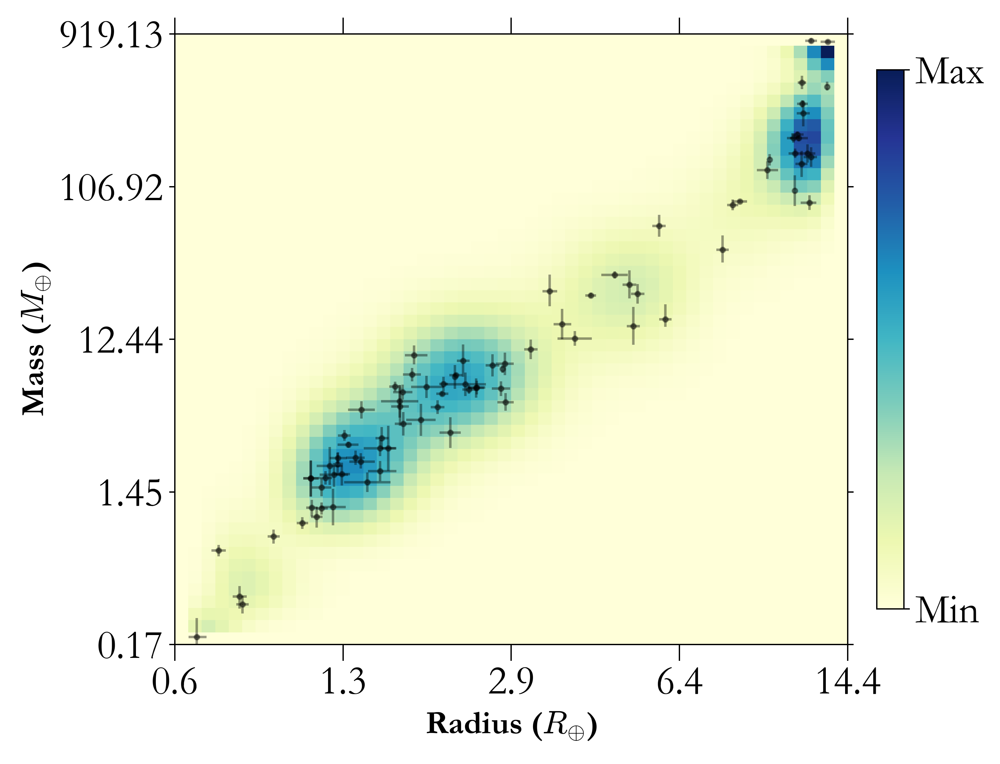

.. _mdwarf:

M-dwarf Planetary Relations️
=================================

In v1.1 we also include a pre-conditioned M-dwarf sample fit consisting of  88 planets with precise (> 3-sigma) masses and radii, and stellar effective temperatures < 4200 K. 
We perform three fits of increasing complexity on this dataset in 2-D, 3-D and 4-D as follows. This is to account for the effect of stellar mass, insolation (in addition to planetary radius) to the planetary mass as shown in `Figure 6 from Kanodia et al. (2023) <https://ui.adsabs.harvard.edu/abs/2023ApJ...956...76K/abstract>`_ 
Though the example shown here is only for an M-dwarf planet sample, in principle, the same can be performed on any sample.

2D Distributions --- f(m|r)
--------------------------------------
This is the traditional mass-radius fit in 2D, similar to that performed in `Kanodia et al. (2019) <https://ui.adsabs.harvard.edu/abs/2019ApJ...882...38K>`_ , but on an updated sample of 88 planets compared to the 24 there. The joint distribution for this fit is shown below and utilizes a grid of 60 x 60 weights.

  **Figure 1:** M-dwarf 2D mass-radius joint distribution.

While users can use the inference examples :ref:`here <inference>` to perform any inference of their choice, we also include an in-built function to infer planetary mass from radius. This can be called as follows - 

  .. code-block:: python

    from mrexo.predict_nd import Mdwarf_InferPlMass_FromPlRadius
    # To infer the planetary mass for three planets with radii as 8, 10, and 12 earth radius,
    # with an output in earth masses
    print(Mdwarf_InferPlMass_FromPlRadius(pl_rade = [8, 10, 12]))

The sample script for this is included in the `Mdwarf prediction functions <https://github.com/shbhuk/mrexo/blob/v1.10dev/sample_scripts/MdwarfRuns/MdwarfPrediction.py>`_  . 

3D Distributions --- f(m|r, stm)
---------------------------------------------
As an improvement to the previous 2D relation, the user can also infer from a 3D relationship, where the planetary mass is conditioned in planetary radius and the stellar mass. This can be done with the in-built function as follows.

  .. code-block:: python

    from mrexo.predict_nd import Mdwarf_InferPlMass_FromPlRadiusStMass
    # To infer the planetary mass for a grid of planets with radii as 8, 10, and 12 earth radius, 
    # and stellar masses as 0.4, 0.5 and 0.6 sol mass. The output is in earth masses
    print(Mdwarf_InferPlMass_FromPlRadiusStMass(pl_rade=[8, 10, 12],  st_mass=[0.4, 0.5, 0.6]))

The sample script for this is included in the `Mdwarf prediction functions <https://github.com/shbhuk/mrexo/blob/v1.10dev/sample_scripts/MdwarfRuns/MdwarfPrediction.py>`_  . 

4D Distributions --- f(m|r, insol, stm) 
-----------------------------------------------------
As an improvement to the previous 3D relation, the user can also infer from a 4D relationship, where the planetary mass is conditioned in planetary radius, stellar mass and insolation flux. This can be done with the in-built function as follows.

  .. code-block:: python

    from mrexo.predict_nd import Mdwarf_InferPlMass_FromPlRadiusInsolStMass
    # To infer the planetary mass for a grid of planets with radii as 8, 10, and 12 earth radius, 
    #and stellar masses as 0.4, 0.5 and 0.6 sol mass, and insolation fluxes of 100 and 500 Searth. The output is in earth masses
    print(Mdwarf_InferPlMass_FromPlRadiusInsolStMass(pl_rade=[8, 10, 12], pl_insol=[100, 500], st_mass=[0.4, 0.5, 0.6]))

    # The user can also do this for a single planet as follows
    print(Mdwarf_InferPlMass_FromPlRadiusInsolStMass(pl_rade=10, pl_insol=100, st_mass=0.5))

The sample script for this is included in the `Mdwarf prediction functions <https://github.com/shbhuk/mrexo/blob/v1.10dev/sample_scripts/MdwarfRuns/MdwarfPrediction.py>`_  . 

